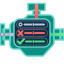

<p align="center">
  
</p>

# Validation Rules Engine (VRE)

Validation Rules Engine (VRE) is an extensible monorepo for policy-driven model and form validation. It separates a framework-independent rules engine from framework adapters, so validation behavior can stay reusable and testable while each UI integration owns its lifecycle and rendering concerns.

The repository ships a core engine plus production Angular and React adapters inside a multi-application developer platform. A framework-neutral portal launches the documentation site, Angular showcases, a hooks-first React showcase, and a vanilla TypeScript core showcase from one command.

## Hosted demo

The public single-host demo is on GitHub Pages:

**https://kalyan-k.github.io/validation-rules-engine/**

| Surface | URL |
| --- | --- |
| Portal | https://kalyan-k.github.io/validation-rules-engine/ |
| Documentation | https://kalyan-k.github.io/validation-rules-engine/docs/overview |
| Vanilla JS Showcase | https://kalyan-k.github.io/validation-rules-engine/showcases/vanilla/ |
| Angular Showcase | https://kalyan-k.github.io/validation-rules-engine/showcases/angular/ |
| React Showcase | https://kalyan-k.github.io/validation-rules-engine/showcases/react/ |
| Tests & Coverage | https://kalyan-k.github.io/validation-rules-engine/reports/index.html |
| Automation Testing | https://kalyan-k.github.io/validation-rules-engine/automation/ |
| About | https://kalyan-k.github.io/validation-rules-engine/about/ |
| Contact | https://kalyan-k.github.io/validation-rules-engine/contact/ |

## Key features

- Fluent, reusable validation rules organized into named policies
- Framework-independent validators, contracts, results, and model-state utilities
- Angular template-driven forms integration through a directive and provider service
- React 19.2 provider, engine, hooks, controlled-field props, and accessible error components
- Nested model paths, conditional rules, asynchronous rules, and dependent fields
- Form-group and multi-policy-group validation status
- Field, group, policy-group, and page-level error summaries
- Bootstrap, Angular Material, Tailwind-friendly, generic, automatic, and custom display strategies
- One-command portal with application health monitoring and automatic browser launch
- Instant documentation search across titles, headings, prose, and code with section deep links
- Independent tests, 90% coverage gates, and browsable reports for every package and showcase project
- Enforced dependency direction from Angular/React showcases to their adapters to core, and from the vanilla showcase directly to core

## Why Validation Rules Engine?

Validation logic often becomes scattered across templates, components, event handlers, and backend-shaped models. Validation Rules Engine gives that behavior an explicit home. A policy describes what a model requires; an adapter connects that policy to a framework; display strategies decide how errors appear.

This separation makes rules easier to reuse, test, review, and evolve without tying the engine to a particular UI framework. Existing Angular behavior remains intact while React receives an isolated hooks-first integration.

## Architecture

```text
apps/portal (launcher) ----URLs----> apps/docs
         |                         apps/angular-showcase
         |                         apps/react-showcase
         |                         apps/vanilla-showcase
         |
         +---- application registry and health status

Angular showcase --> @validation-rules-engine/angular --> @validation-rules-engine/core
React showcase ----> @validation-rules-engine/react -----> @validation-rules-engine/core
Vanilla showcase --------------------------------------> @validation-rules-engine/core
```

Dependencies flow in one direction. Each private showcase consumes its framework adapter, each adapter consumes the core public entry point, and core has no Angular or React dependency. `npm run architecture:verify` enforces these boundaries and rejects speculative Vue placeholders.

See [Architecture](docs/architecture.md) for ownership decisions and extension guidance.

## Repository structure

```text
validation-rules-engine/
|-- apps/
|   |-- portal/                # framework-neutral launcher, health dashboard, and report gateway
|   |-- docs/                  # Markdown-backed documentation website
|   |-- angular-showcase/      # Angular UI framework and state-management showcases
|   |-- react-showcase/        # hooks-first controlled React forms
|   `-- vanilla-showcase/      # core-only TypeScript + Vite forms
|-- packages/
|   |-- angular/               # @validation-rules-engine/angular and Angular CLI workspace
|   |-- core/                  # @validation-rules-engine/core and core Karma config
|   `-- react/                 # @validation-rules-engine/react ESM package
|-- docs/
|   |-- site/                  # documentation website source pages
|   |-- architecture.md
|   |-- rebranding-report.md
|   `-- testing.md
|-- tools/
|   |-- architecture/          # dependency-boundary verification
|   |-- platform-shell/        # shared product shell, theme, and navigation
|   `-- testing/               # shared Karma config and persistent reports
|-- package.json               # private npm-workspaces root
`-- tsconfig.json
```

## Installation

Angular consumers install the core engine, Angular adapter, and Underscore peer dependency together:

```bash
npm install @validation-rules-engine/core @validation-rules-engine/angular underscore
```

Angular framework packages are peer dependencies of `@validation-rules-engine/angular`.

React consumers install the core and React packages with the tested React 19.2 peers:

```bash
npm install @validation-rules-engine/core @validation-rules-engine/react react react-dom
```

See the [React quick start](docs/site/react/react-quick-start.md) for provider, policy, field hook, native input, summary, and submit examples.

To use the optional default stylesheet, add its stable package entry point to the Angular workspace configuration:

```json
{
  "styles": [
    "node_modules/@validation-rules-engine/angular/styles/policy-validation.css"
  ]
}
```

The `policy-validation.css` filename and `policy-validation-*` DOM/CSS hooks are retained as compatibility APIs. Package names and repository identity changed; existing selectors and styling integrations did not.

## Quick start

Define a policy:

```typescript
import {
  ValidationPolicy,
  Validator,
  ValidatorHelper
} from '@validation-rules-engine/angular';

export class UserFormPolicy implements ValidationPolicy {
  addValidations(v: ValidatorHelper): Validator[] {
    return [
      v.validateFor('email')
        .isRequired('Email is required')
        .isEmail('Enter a valid email address')
    ];
  }
}
```

Configure the Angular module and register the policy:

```typescript
import { NgModule } from '@angular/core';
import {
  ValidationModule,
  ValidationProviderService
} from '@validation-rules-engine/angular';

@NgModule({
  imports: [ValidationModule.forRoot({ preset: 'bootstrap' })]
})
export class AppModule {
  constructor(validation: ValidationProviderService) {
    validation.register('UserForm', new UserFormPolicy());
    validation.registerFormGroupPolicy('userForm', 'UserForm');
  }
}
```

Attach the existing directive API to a template-driven control:

```html
<input
  [(ngModel)]="model.email"
  policyValidator
  [validateModel]="'user.email'"
  [actualModel]="model"
  [withPolicy]="'UserForm'"
  groupName="userForm"
/>
```

## Advanced example

Use multiple policies and form groups for a multi-step workflow:

```typescript
validation.register('PersonalInfo', personalInfoPolicy);
validation.register('ShippingAddress', shippingPolicy);
validation.register('BillingAddress', billingPolicy);

validation.registerPolicyGroup('checkout', {
  policies: ['PersonalInfo', 'ShippingAddress', 'BillingAddress'],
  formGroups: ['personalInfo', 'shippingInfo', 'billingInfo']
});

validation.evaluatePolicies(order, ['PersonalInfo', 'ShippingAddress', 'BillingAddress'])
  .subscribe(() => {
    if ((order.validationResults ?? []).length === 0) {
      submitOrder(order);
    }
  });
```

The Angular adapter also supports generated forms through `replacePolicy()`, explicit state cleanup, and custom display strategies.

## Policies

A policy implements `ValidationPolicy` and returns validators for one model concern. Policies are registered under stable names, can be replaced for dynamic forms, and can be evaluated individually or as a set. The existing Angular expression-based `Policy` executor stays in the adapter because it depends on `@angular/compiler`.

## Rules

`ValidatorHelper` creates fluent validators for model paths. `ValidationHelper` supplies built-in checks such as required values, email shape, numbers, ranges, and conditional rules. Core exports the rule engine directly; Angular re-exports its historically public neutral symbols for consumer compatibility.

## Groups

Form groups aggregate field status for one portion of a view. Policy groups aggregate policies and form groups across larger workflows such as checkout or onboarding. Angular status and summary components render these states using the unchanged `policy-validation-*` selectors.

## Package overview

| Workspace | Package | Responsibility |
| --- | --- | --- |
| `packages/core` | `@validation-rules-engine/core` | Framework-neutral contracts, rules, validators, results, and model-state utilities |
| `packages/angular` | `@validation-rules-engine/angular` | Angular policy execution, forms integration, directives, services, components, and display strategies |
| `packages/react` | `@validation-rules-engine/react` | React validation engine, provider, hooks, controlled-field helpers, and accessible messages |
| `apps/angular-showcase` | private | Browser showcase, Angular UI framework examples, and Angular state-management integrations |
| `apps/react-showcase` | private | Home, simple, complex, and performance React examples |
| `apps/vanilla-showcase` | private | Core-only TypeScript + Vite simple, complex, and performance forms |
| `apps/docs` | private | Search-ready Markdown documentation server and site shell |
| `apps/portal` | private | Application launcher, status API, report gateway, and product dashboard |

Build artifacts are written beneath `dist/`, with publishable packages in `dist/packages/*`, browser showcases in `dist/showcases/*`, Node platform applications in `dist/apps/*`, and the assembled production website in `dist/site/*`.

## Portal and showcase platform

Start the complete local experience with one command:

```bash
npm start
```

The command builds and verifies one production host at `http://127.0.0.1:4200`. Documentation is served from `/docs/`, Angular from `/showcases/angular/`, React from `/showcases/react/`, Vanilla from `/showcases/vanilla/`, tests and coverage from `/reports/`, and Playwright automation from `/automation/`. No secondary application ports or child processes are required.

`npm run start:single-host` is the explicit equivalent of `npm start`. Use `npm run start:multi-host` (or its `npm run portal` alias) for the separately served local platform on ports `4200`, `4201`, `4202`, and `4204`. Use `npm run portal:dev` only when live Angular and React development servers are required. Production uses `npm run build:site` followed by `npm run serve:single-host`; `VRE_PORTAL_PORT`, `VRE_PUBLIC_URL`, `VRE_HOST`, `VRE_NO_OPEN`, and `VRE_BUILD_TIME` configure the single Node process without rebuilding browser code.

The application registry in `apps/portal/src/applications.ts` is the single place to add a future showcase application. Each application remains independently runnable and communicates through stable local URLs.

All browser applications use the framework-neutral shell in `tools/platform-shell`. It provides one product identity, a compact Home / Docs / Showcases / Reports / About / Contact / GitHub navigation, footer, page width, spacing system, breadcrumbs, action bars, cards, responsive breakpoints, and shared logo/icon assets while leaving each application's framework-specific components intact. The shell stylesheet is preloaded and the custom element is defined before application scripts to avoid navigation flicker.

Documentation search is performed from a browser-cached index and returns highlighted title, heading, prose, and code matches with direct section links and full keyboard navigation. Generated reports use the exact shared application shell: collapsible Packages and Showcase Applications groups plus Summary / Tests / Coverage tabs update one workspace, while the original Istanbul output remains unchanged.

## Roadmap

- Continue strengthening the framework-neutral engine and adapter contract
- Evaluate a parser abstraction that could move expression execution out of Angular without changing behavior
- Maintain synchronized Semantic Versioning, changelogs, provenance, and consumer migration guidance
- Add Vue or other adapters only with complete implementations, tests, documentation, and real consumer showcases

React is implemented and verified; no Vue or other framework placeholder exists in this repository.

## Development

Requirements are Node.js 22, npm, and a locally available Chrome or Chromium browser for Karma.

```bash
npm install
npm run architecture:verify
npm test
npm run build:all
```

| Command | Purpose |
| --- | --- |
| `npm start` / `npm run start:single-host` | Build and launch the single-origin production host |
| `npm run start:multi-host` / `npm run portal` | Build and launch the separately served multi-host platform |
| `npm run portal:dev` | Launch the multi-host platform with framework development servers |
| `npm run build:site` | Assemble all hosted applications under `dist/site` |
| `npm run site:verify` | Verify production routes, base paths, assets, and embedded application health |
| `npm run serve:angular-showcase` | Serve only the Angular showcase |
| `npm run serve:docs` | Build and serve only the documentation site |
| `npm run build` | Build core plus Angular and React adapters in dependency order |
| `npm run build:all` | Build packages, both Node applications, and both showcases |
| `npm run build:angular-showcase` | Build the Angular showcase and its package dependencies |
| `npm run build:react` / `npm run build:react-showcase` | Build the React package or showcase and dependencies |
| `npm test` | Run Node, Angular/Karma, and React/Vitest suites |
| `npm run test:coverage` | Run all tests and independent 90% coverage gates |
| `npm run test:reports` | Generate and verify browsable reports for every project |
| `npm run test:e2e:smoke` | Run the fast Playwright browser smoke suite |
| `npm run test:e2e` | Run repository-level Playwright E2E tests in Chromium |
| `npm run test:hosting` | Verify every shared top-menu URL in single-host and multi-host modes |
| `npm run reports:open` | Open the generated report dashboard |
| `npm run lint:all` | Lint every configured project |
| `npm run version:check` | Verify synchronized package versions and Core peer compatibility |
| `npm run pack:packages:dry-run` | Inspect all three npm package payloads without publishing |
| `npm run release:verify` | Run every release quality gate before tagging or publishing |

See [Single-host deployment](docs/site/single-host-deployment.md), [Release and versioning](docs/site/release-versioning.md), [Testing and reports](docs/site/testing.md), and [Playwright E2E Testing](docs/site/playwright.md) for deployment, publishing, report locations, coverage scope, CI behavior, browser automation, and troubleshooting.

## Contributing

Keep changes within the established dependency direction and preserve public behavior unless a breaking release is explicitly planned. Before opening a pull request, run:

```bash
npm ci
npm run version:check
npm run architecture:verify
npm run test:reports
npm run build:site
npm run site:verify
npm run lint:all
```

Add behavior-focused tests with production changes, do not exclude executable code to raise coverage, and do not scaffold future-framework packages without an implementation. The root and showcase packages are private. The release workflow publishes only synchronized, tagged, quality-gated package artifacts through npm trusted publishing.

## License

MIT - see [LICENSE](LICENSE).
